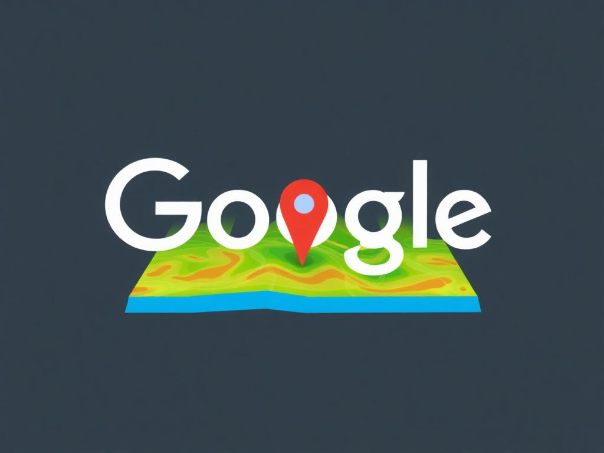

# 🌊 Next.js Water Detection App



This project is a cutting-edge Next.js application that leverages Google Maps to detect whether a location is on water or land. It's perfect for geography enthusiasts, environmental researchers, or anyone curious about their surroundings!

## 🚀 Features

- 🗺️ Interactive Google Map
- 💧 Real-time water/land detection using advanced algorithms
- 📍 Precise location information display
- 🖱️ User-friendly drag-and-drop marker functionality
- 🎨 Sleek and responsive UI with Tailwind CSS

## 🧠 How it works

1. Click anywhere on the map to drop a marker
2. The app uses the `is-it-water` library to determine if the location is on water or land
3. Drag the marker to update the information in real-time
4. View detailed location data in the info box

## 🛠️ Tech Stack

- Next.js 14 - React framework for server-side rendering and static site generation
- React 18 - JavaScript library for building user interfaces
- Tailwind CSS - Utility-first CSS framework for rapid UI development
- Google Maps API - Powerful mapping platform for location-based services
- is-it-water library - Efficient water detection algorithm

## 🚀 Quick Start

1. Clone the repository
2. Install dependencies:


```bash
npm run dev
# or
yarn dev
# or
pnpm dev
# or
bun dev
```

Open [http://localhost:3000](http://localhost:3000) with your browser to see the result.


## 📦 Project Structure

- `src/app/page.js`: Main application component
- `src/app/useGoogleMap.js`: Custom hook for Google Maps functionality
- `src/components/infobox.jsx`: InfoBox component for displaying location data
- `src/app/globals.css`: Global styles and Tailwind CSS configuration

## 🧩 Key Components

### Google Maps Integration

The `useGoogleMap` hook handles the Google Maps integration:

## 🧠 How it works

1. Click anywhere on the map to drop a marker
2. The app will determine if the location is on water or land
3. Drag the marker to update the information

## 📚 Learn More

To dive deeper into Next.js, check out these resources:

- [Next.js Documentation](https://nextjs.org/docs) - learn about Next.js features and API.
- [Learn Next.js](https://nextjs.org/learn) - an interactive Next.js tutorial.

Feel free to explore [the Next.js GitHub repository](https://github.com/vercel/next.js/). Your feedback and contributions are welcome!


## 🔒 Environment Variables

Make sure to set up your Google Maps API key in the `.env.local` file:

## 🚀 Deployment

Deploy your Next.js app easily using the [Vercel Platform](https://vercel.com/new?utm_medium=default-template&filter=next.js&utm_source=create-next-app&utm_campaign=create-next-app-readme).

Check out the [Next.js deployment documentation](https://nextjs.org/docs/deployment) for more details.

## 🤝 Contributing

Contributions, issues, and feature requests are welcome! Feel free to check the [issues page](https://github.com/SujalXplores/google-map-detect-water/issues).

## 📝 License

This project is [MIT](https://choosealicense.com/licenses/mit/) licensed.

---

Made with ❤️, Next.js, and a splash of water 🌊
